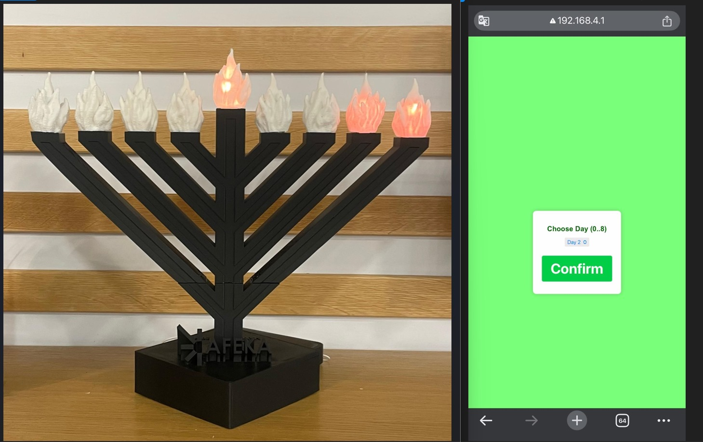

# Hanukkah LED Menorah (Hanukiah)

This project is a Wi-Fi-controlled LED Hanukiah (Menorah) for Chanukah, featuring a custom flickering flame effect. The user can select the day via a web interface, and the corresponding number of "candles" (LED segments) light up. The project uses the NeoPixel library and includes STL files for 3D printing all parts needed for assembly.

## Features

- **Wi-Fi Access Point**: A built-in web server allows you to connect and select the day of Hanukkah to light.
- **Day Selection**: Choose any day from 1–8. Each day lights up that many LED "candles," plus the shamash (helper lamp).
- **Fire/Flame Effect**: Each LED flickers with a random red/orange glow to mimic real flames.
- **Adafruit NeoPixel**: Uses the NeoPixel library to control WS2812/WS2812B LED strips.

## Hardware

- **Controller**: Wemos D1 mini (ESP8266-based).
- **LED Strip**: WS2812B or compatible, controlled via NeoPixel.
- **3D-Printed Parts**: Includes STL files for all components required to build the Menorah. Some parts are inspired by [Thingiverse Thing #604228](https://www.thingiverse.com/thing:604228) and modified for this project.

## Platform & Tools

- **PlatformIO** for building and uploading the code.
- **Arduino Framework**.
- **Adafruit NeoPixel** library for LED animations.

## How It Works

1. **Power on** the Wemos D1 mini.
2. The device creates a **Wi-Fi Access Point** (default SSID and password can be configured in the code).
3. Connect to the AP and navigate to the IP address (e.g., `192.168.4.1`) in your browser.
4. **Select a day** (1–8) to light up that many LED candles, plus the shamash. Selecting "Off" (0) turns all LEDs off.
5. Watch the flickering flame effect as the LEDs light up in sequence.

## Notes

- This project leverages the **Adafruit NeoPixel** library for precise LED control.
- The **flickering flame effect** is achieved by generating random red/orange color values for each LED.
- Includes STL files for all 3D-printed parts required for the physical Menorah.
- All code and instructions are provided as-is, and you can customize them for your setup.

Enjoy your new **LED Hanukiah** and Chag Sameach!

